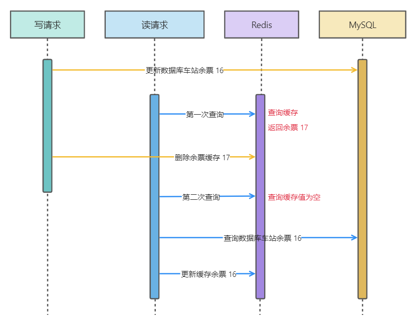
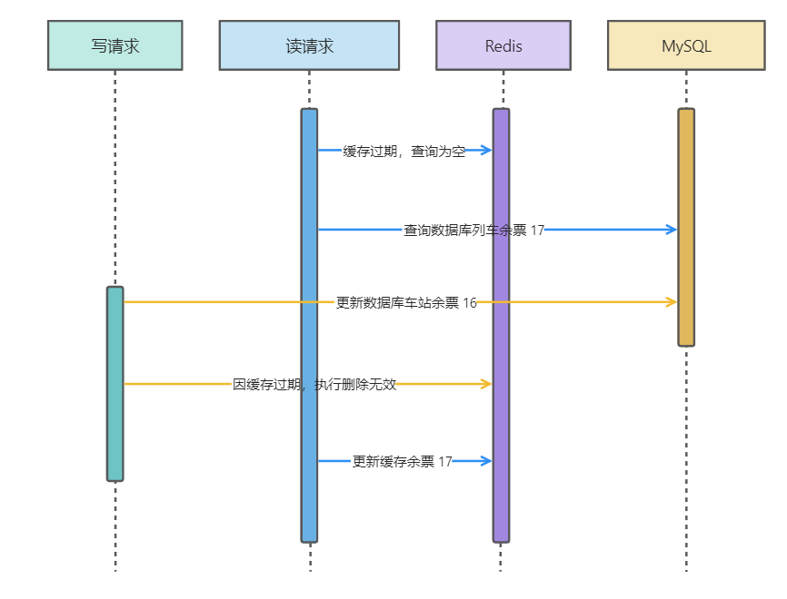
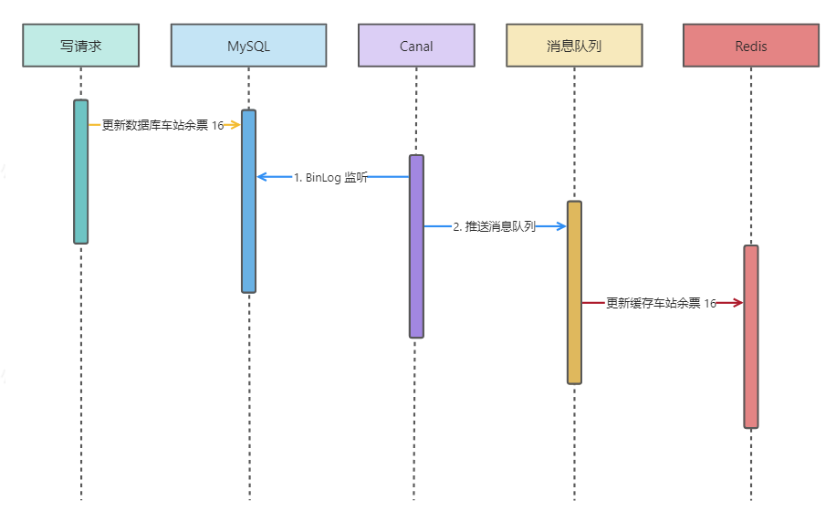

为了能让用户获取到数据更快，我们采用缓存的策略。但是在更新操作时，我们需要保证缓存和数据库的数据一致性。本文介绍几种常用的缓存和数据库一致性解决策略。

<!--more-->

## Cache Aside

Cache Asside即旁路缓存，是保证缓存和数据库一致性常用的一种策略。当面临数据更新时，先更新数据库，然后删除缓存。

这种模型会出现一种小的错误，导致读取的数据和实际的数据不一致（如图）。其主要原因是更新数据库的数据以后，还没来得及删除缓存，读取请求就打到了缓存中。不过这种可能性比较小，并且毕竟是读取请求，可以容忍一定时间的数据不一致问题。

还有一种相对影响较大的问题，就是可能会出现查询数据不存在，并且放入缓存的请求在更新缓存之后，就导致了缓存了错误的数据的情况。

不过这种情况的可能性也及其小，实际业务中可以容忍。

## 消息队列最终一致性

这种方法通过消息队列将更新数据库的操作和更新缓存的操作解耦：当更新完数据库时，先将消息放入消息队列，然后消费者消费消息，更新缓存。这种方式可以保证缓存和数据库的数据一致性，但是会引入一定的延迟。